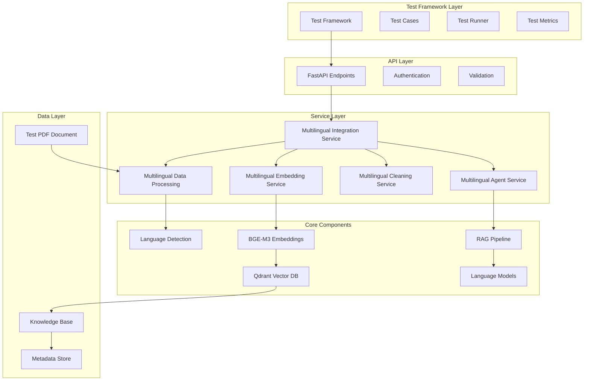

# Design Document

## Overview

This design document outlines the architecture and implementation approach for comprehensive end-to-end testing of the multilingual capabilities in the EcoStance Agent system. The testing framework will validate the complete pipeline from document ingestion through extraction, cleanup, embedding generation, retrieval, RAG processing, and agent interaction using the provided multilingual logistics FAQ PDF as the primary test source.

The system leverages BGE-M3 multilingual embeddings, automatic language detection, cross-language search capabilities, and a sophisticated RAG pipeline to provide seamless multilingual support across 100+ languages with particular focus on Tier 1 languages (English, Spanish, French, German, Portuguese).

## Architecture

The multilingual testing architecture follows a layered approach that mirrors the production system:



## Components and Interfaces

### Test Framework Components

**TestFramework**: Main orchestrator for multilingual testing
- Manages test execution lifecycle
- Coordinates between different test suites
- Provides reporting and metrics collection
- Handles test data setup and cleanup

**MultilingualTestSuite**: Specialized test suite for multilingual operations
- Document processing tests
- Embedding generation tests
- Search and retrieval tests
- Agent conversation tests
- Performance benchmarking tests

**APITestClient**: HTTP client for testing API endpoints
- Handles authentication and session management
- Provides typed request/response interfaces
- Manages test data uploads and downloads
- Supports concurrent testing scenarios

### Service Integration Interfaces

**IMultilingualProcessor**: Interface for document processing
```python
async def process_document(file_path: str, tenant_id: str) -> ProcessingResult
async def get_processing_status(job_id: str) -> ProcessingStatus
async def validate_extraction(result: ProcessingResult) -> ValidationReport
```

**IMultilingualEmbedding**: Interface for embedding operations
```python
async def generate_embeddings(text_blocks: List[TextBlock]) -> List[Embedding]
async def store_embeddings(embeddings: List[Embedding], collection: str) -> StorageResult
async def query_embeddings(query: str, collection: str, language: str) -> List[SearchResult]
```

**IMultilingualAgent**: Interface for agent testing
```python
async def create_session(tenant_id: str, language: str) -> SessionInfo
async def send_message(session_id: str, message: str) -> AgentResponse
async def get_conversation_history(session_id: str) -> List[ConversationTurn]
```

## Data Models

### Core Data Structures

**TestDocument**: Represents the multilingual test document
```python
@dataclass
class TestDocument:
    file_path: str
    expected_languages: List[str]
    expected_content_blocks: int
    content_samples: Dict[str, str]  # language -> sample text
    metadata: Dict[str, Any]
```

**ProcessingResult**: Results from document processing
```python
@dataclass
class ProcessingResult:
    job_id: str
    status: ProcessingStatus
    detected_languages: List[LanguageDetection]
    text_blocks: List[TextBlock]
    processing_time: float
    errors: List[ProcessingError]
```

**EmbeddingResult**: Results from embedding generation
```python
@dataclass
class EmbeddingResult:
    embedding_id: str
    vector: List[float]
    dimension: int
    language: str
    text_block_id: str
    metadata: Dict[str, Any]
    generation_time: float
```

**SearchResult**: Results from multilingual search
```python
@dataclass
class SearchResult:
    document_id: str
    score: float
    content: str
    language: str
    metadata: Dict[str, Any]
    cross_language_match: bool
```

**AgentResponse**: Response from multilingual agent
```python
@dataclass
class AgentResponse:
    response_text: str
    response_language: str
    sources_used: List[SearchResult]
    tools_invoked: List[str]
    processing_time: float
    confidence_score: float
```

## Correctness Properties

*A property is a characteristic or behavior that should hold true across all valid executions of a system-essentially, a formal statement about what the system should do. Properties serve as the bridge between human-readable specifications and machine-verifiable correctness guarantees.*

### Property Reflection

After reviewing all identified properties, several can be consolidated to eliminate redundancy:

- Properties related to API response format (6.1, 6.2, 6.3, 6.5) can be combined into a comprehensive API response validation property
- Properties related to language detection (1.2, 3.1, 8.4) can be consolidated into a single language detection accuracy property
- Properties related to embedding storage and retrieval (1.5, 2.2, 2.3, 2.5) can be combined into an embedding storage consistency property
- Properties related to performance timing (7.1, 7.2, 7.3, 7.4) can be grouped under performance benchmarking
- Properties related to semantic consistency (4.4, 8.1, 8.3) can be consolidated into semantic preservation across languages

### Core Properties

Property 1: Document processing pipeline completeness
*For any* multilingual PDF document, processing through extraction, language detection, cleaning, and embedding generation should result in complete coverage of all text content with proper language metadata
**Validates: Requirements 1.1, 1.2, 1.3, 1.4, 1.5**

Property 2: BGE-M3 embedding consistency
*For any* text content processed through the multilingual pipeline, generated embeddings should have 1024 dimensions, unit length normalization, and be stored with correct language metadata in collections with "_ml" suffix
**Validates: Requirements 2.1, 2.2, 2.3, 2.4, 2.5**

Property 3: Cross-language search effectiveness
*For any* search query in a supported language, the system should return semantically relevant results from content in any language, with proper language metadata and confidence scores
**Validates: Requirements 3.1, 3.2, 3.3, 3.4, 3.5**

Property 4: Multilingual RAG coherence
*For any* question asked in a supported language, the RAG pipeline should retrieve relevant multilingual context, synthesize information across languages, and generate responses in the query language while maintaining factual accuracy
**Validates: Requirements 4.1, 4.2, 4.3, 4.4, 4.5**

Property 5: Agent conversation consistency
*For any* multilingual conversation session, the agent should maintain language preferences, use appropriate multilingual tools, and provide coherent responses with proper cross-language context
**Validates: Requirements 5.1, 5.2, 5.3, 5.4, 5.5**

Property 6: API interface compliance
*For any* multilingual API operation, responses should include proper language metadata, status information, and maintain session state consistency across calls
**Validates: Requirements 6.1, 6.2, 6.3, 6.4, 6.5**

Property 7: Performance benchmarks
*For any* multilingual operation, processing times should meet specified thresholds: document processing <30s, embedding generation >100 blocks/min, search queries <2s, agent responses <5s, with concurrent performance within 20% of baseline
**Validates: Requirements 7.1, 7.2, 7.3, 7.4, 7.5**

Property 8: Semantic accuracy preservation
*For any* multilingual content processing, semantic meaning should be preserved in embeddings, cross-language searches should return semantically equivalent content, and language detection should achieve >95% accuracy for supported languages
**Validates: Requirements 8.1, 8.2, 8.3, 8.4, 8.5**

## Error Handling

The multilingual testing framework implements comprehensive error handling across all layers:

### Processing Errors
- **Language Detection Failures**: Handle cases where language detection confidence is below threshold
- **Embedding Generation Errors**: Manage BGE-M3 model failures and dimension mismatches
- **Storage Failures**: Handle Qdrant connection issues and collection creation failures
- **Extraction Errors**: Manage PDF parsing failures and content corruption

### API Error Responses
- **Authentication Failures**: Invalid tenant credentials or expired tokens
- **Validation Errors**: Malformed requests or unsupported file formats
- **Rate Limiting**: Handle concurrent request limits and backoff strategies
- **Service Unavailability**: Manage downstream service failures gracefully

### Test Framework Errors
- **Test Data Issues**: Missing or corrupted test documents
- **Environment Problems**: Service configuration or connectivity issues
- **Assertion Failures**: Detailed reporting of property violations
- **Performance Degradation**: Handling of timeout and performance threshold violations

## Testing Strategy

### Dual Testing Approach

The testing strategy employs both unit testing and property-based testing approaches:

**Unit Testing**: Verifies specific examples, edge cases, and error conditions
- API endpoint functionality with known inputs
- Language detection with specific text samples
- Embedding generation with controlled content
- Agent responses to predefined queries

**Property-Based Testing**: Verifies universal properties across all inputs
- Document processing completeness across various content types
- Cross-language search effectiveness with generated queries
- Performance characteristics under varying loads
- Semantic preservation across language boundaries

### Property-Based Testing Implementation

The framework uses Hypothesis for Python property-based testing with a minimum of 100 iterations per property test. Each property-based test is tagged with comments explicitly referencing the correctness property from this design document using the format: **Feature: multilingual-e2e-testing, Property {number}: {property_text}**

### Test Data Strategy

**Primary Test Document**: logistics-multilanguage.pdf
- Contains content in multiple languages (English, Spanish, French, German)
- Includes logistics-specific terminology and FAQ format
- Provides realistic multilingual content for comprehensive testing

**Generated Test Data**: 
- Synthetic multilingual queries for property-based testing
- Performance test datasets with varying sizes and languages
- Edge case content (mixed languages, special characters, formatting)

**Validation Datasets**:
- Known-good language detection samples
- Semantic similarity benchmarks across languages
- Performance baseline measurements

### Test Execution Flow

1. **Environment Setup**: Initialize multilingual services and test data
2. **Document Processing Tests**: Upload and process test PDF through complete pipeline
3. **Embedding Validation Tests**: Verify BGE-M3 embedding generation and storage
4. **Search Functionality Tests**: Validate cross-language search capabilities
5. **RAG Pipeline Tests**: Test multilingual context retrieval and response generation
6. **Agent Integration Tests**: End-to-end conversation testing with multilingual capabilities
7. **Performance Benchmarking**: Measure and validate performance characteristics
8. **Cleanup and Reporting**: Generate comprehensive test reports and clean up test data

The testing framework provides detailed reporting on property violations, performance metrics, and semantic accuracy measurements to ensure the multilingual system meets all specified requirements.