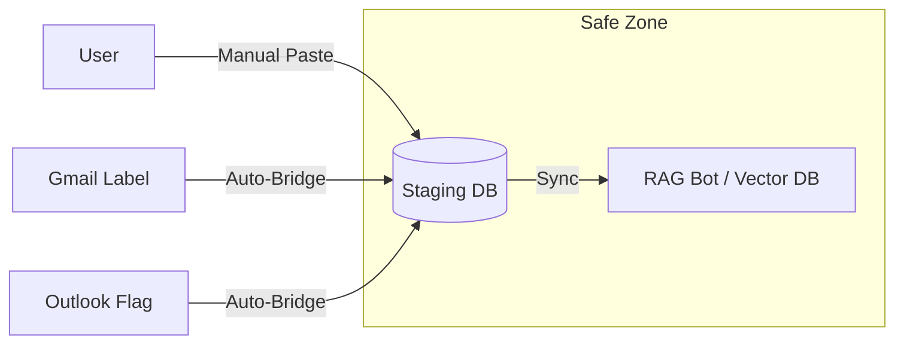

# Custom CRM / Email Staging Area Integration Plan

## Executive Summary
Instead of giving the RAG Bot direct access to third-party email inboxes (and dealing with complex permissions/OAuth risks), we will build a **"Staging App" (Custom CRM)**.

Data flows **into** this app (via manual entry or controlled bridges), and the RAG Bot **strictly reads only from this app**.

## Architecture: " The Airlock Strategy"

### 1. The Data Model (The "Staged Email")
We create a new generic table `StagedEmail` that abstracts away the source.
- `id`: UUID
- `source`: "manual", "gmail", "outlook", "csv_upload"
- `external_id`: Original ID from source (optional)
- `sender`: String
- `subject`: String
- `body`: Text
- `received_at`: DateTime
- `status`: "pending", "approved", "ingested", "rejected" (Allows for a review workflow)

### 2. The API (The "Inlet")
We expose standard endpoints to "Push" data into the system.

- **`POST /api/v1/staging/emails`**: Create a new entry.
    - payload: `{ source, subject, body, sender, date }`
    - *Auto-triggers RAG processing if `status=approved`.*
- **`GET /api/v1/staging/emails`**: View the holding area.
- **`PUT /api/v1/staging/emails/{id}/approve`**: Manually approve an email for RAG ingestion (if review mode is on).

### 3. The Bridges (The "Connectors")
We essentially build "Plugins" that feed this API.

*   **The Gmail Bridge**: A background task that checks `label:SendToBot`. For each email found:
    1.  Downloads content.
    2.  Calls `POST /staging/emails` with `source="gmail"`.
    3.  **Removes** the label from Gmail (marking it as "moved to staging").
*   **The Manual Bridge**: A simple UI in your app where you can paste text from anywhere (LinkedIn, Slack, etc.) and hit "Add to Knowledge Base".

### 4. RAG Integration
The RAG pipeline remains identical but becomes simpler. It no longer needs to know how to parse MIME multipart emails or Authenticate with Azure. It just reads clean code from the `StagedEmail` table.

## Implementation Roadmap

### Phase 1: The Core (Staging Area)
1.  Create `StagedEmail` database model.
2.  Create API Router (`staging_router.py`) for CRUD operations.
3.  Implement RAG Service (`StagingRAGService`) to process these generic items.

### Phase 2: The UI (Control Center)
1.  **"Data Inbox" Page**: A table showing all emails sitting in the staging area.
2.  **"Add Manual Entry" Modal**: Simple form to paste subject/body.

### Phase 3: The Gmail Connector
1.  Modify existing `GmailFetchService` to simply *feed* the Staging DB instead of running its own RAG logic.
2.  Configure it to watch specific labels.

## Advantages
1.  **Universal**: Works for Gmail, Outlook, Notion exports, or copy-pasted text.
2.  **Safe**: You can implement a "Human-in-the-loop" review step before data hits the Vector DB.
3.  **Clean**: Decouples "Fetching" (messy) from "Embedding" (clean).
