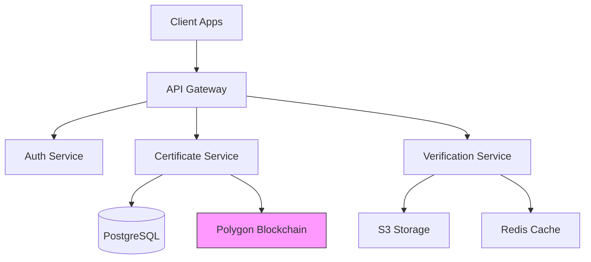

# CertifyDigital Inc. - Developer Onboarding Guide

**Version:** 4.1  
**Last Updated:** November 10, 2025  
**Author:** DevOps Team  
**License:** Internal Use Only

---

## Table of Contents

1. [Introduction](#introduction)
2. [System Architecture](#system-architecture)
3. [Setup Local Environment](#setup-local-environment)
4. [API Reference](#api-reference)
5. [Database Schema](#database-schema)
6. [Blockchain Integration](#blockchain-integration)
7. [Security Best Practices](#security-best-practices)
8. [Testing Strategy](#testing-strategy)
9. [Deployment Pipeline](#deployment-pipeline)
10. [Troubleshooting](#troubleshooting)

---

## Introduction

CertifyDigital issues **verifiable, blockchain-anchored digital credentials** using modern web3 standards. This guide helps developers integrate, extend, or maintain the platform.

> **Core Principle:** All issued certificates are **immutable**, **verifiable**, and **portable**.

---

## System Architecture



- **Frontend:** React + TypeScript + Vite
- **Backend:** Node.js (NestJS) + Python (FastAPI for OCR)
- **Storage:** AWS S3 + CloudFront CDN
- **Queue:** RabbitMQ
- **Monitoring:** Prometheus + Grafana + ELK Stack

---

## Setup Local Environment

### Prerequisites

| Tool | Version |
|------|---------|
| Node.js | >=20 |
| Python | >=3.11 |
| Docker | >=24 |
| PostgreSQL | >=15 |
| Git | latest |

### Steps

```bash
# Clone repo
git clone https://github.com/certifydigital/platform.git
cd platform

# Start services
docker-compose up -d

# Install backend deps
cd backend && npm ci && cd ..
cd ocr-service && pip install -r requirements.txt && cd ..

# Seed database
npm run db:seed
```

---

## API Reference

### Base URL
```
https://api.certifydigital.com/v3
```

### Auth Endpoints

```http
POST /auth/login
Content-Type: application/json

{
  "email": "dev@certifydigital.com",
  "password": "SecurePass123!"
}
```

> Returns JWT (`exp: 24h`)

---

## Database Schema

```sql
-- users table
CREATE TABLE users (
    id UUID PRIMARY KEY DEFAULT gen_random_uuid(),
    email CITEXT UNIQUE NOT NULL,
    password_hash TEXT NOT NULL,
    kyc_status ENUM('pending', 'verified', 'rejected'),
    created_at TIMESTAMPTZ DEFAULT NOW()
);

-- certificates table
CREATE TABLE certificates (
    cert_id VARCHAR(20) PRIMARY KEY,
    user_id UUID REFERENCES users(id),
    template_id VARCHAR(10),
    status ENUM('draft','verifying','issued','revoked'),
    blockchain_tx CHAR(66),
    issued_at TIMESTAMPTZ,
    expires_at TIMESTAMPTZ
);
```

---

## Blockchain Integration

### Smart Contract (Solidity)

```solidity
// CertRegistry.sol
pragma solidity ^0.8.20;

contract CertRegistry {
    mapping(bytes32 => address) public certHashes;
    
    event Anchored(bytes32 indexed hash, address issuer, uint timestamp);
    
    function anchor(bytes32 hash) external {
        require(certHashes[hash] == address(0), "Already anchored");
        certHashes[hash] = msg.sender;
        emit Anchored(hash, msg.sender, block.timestamp);
    }
}
```

Deployed on **Polygon Mumbai** (test) / **Mainnet**

---

## Security Best Practices

| Rule | Implementation |
|------|----------------|
| Passwords | Argon2id hashing |
| JWT | RS256 + rotation every 90 days |
| Rate Limiting | 100 req/min per IP |
| CORS | Whitelist only `*.certifydigital.com` |
| File Uploads | VirusTotal scan + magic byte check |

---

## Testing Strategy

```bash
# Unit tests
npm run test:unit

# Integration tests
npm run test:integration

# E2E with Cypress
npm run test:e2e
```

Coverage: **92%+** required for PR merge.

---

## Deployment Pipeline


- **GitHub Actions** → Build → Test → Deploy to **AWS ECS Fargate**
- **Blue/Green** deployment strategy
- **Canary** for high-risk changes

---

## Troubleshooting

| Symptom | Command |
|--------|---------|
| Verification stuck | `docker logs verification-worker` |
| Blockchain sync lag | `curl https://polygon-rpc.com/health` |
| OCR low confidence | `python ocr/debug.py --file sample.jpg` |

---

**Contact:** devops@certifydigital.com  
**Slack:** `#dev-platform`  
**Docs:** [https://docs.certifydigital.com](https://docs.certifydigital.com)

---
